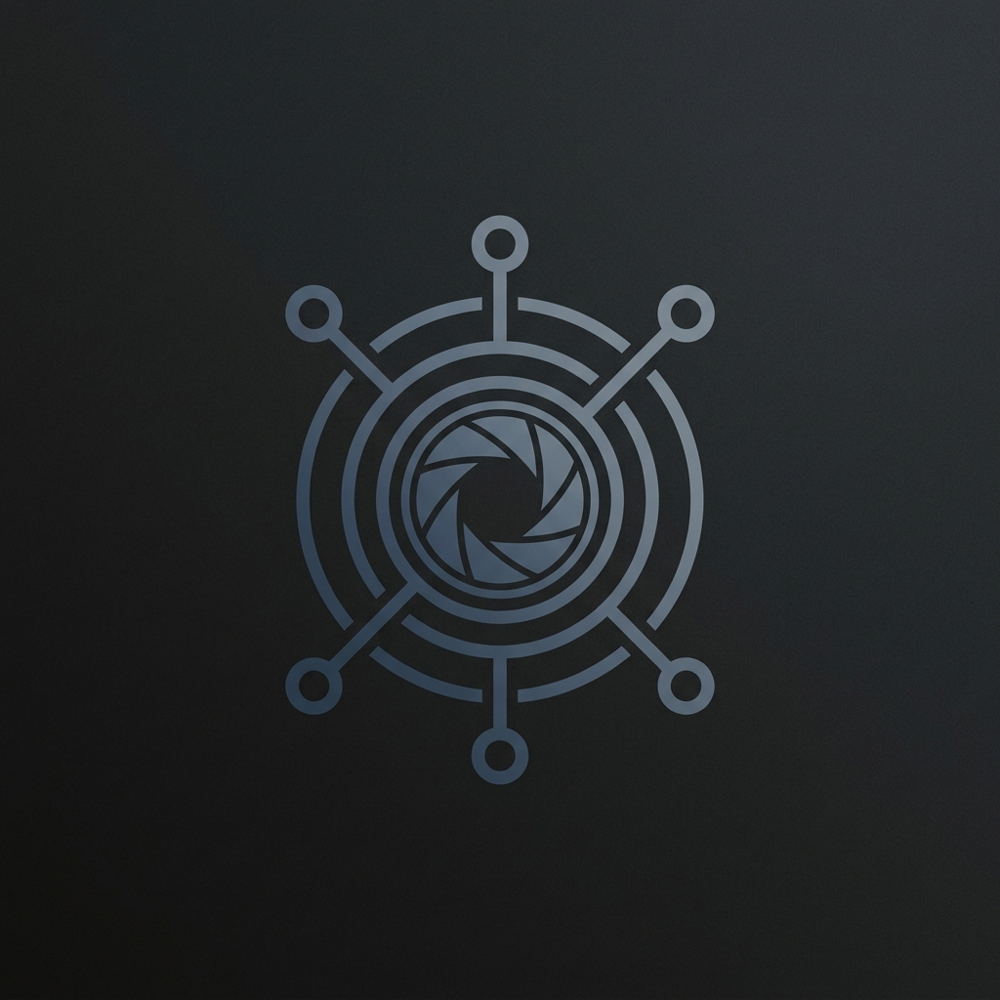
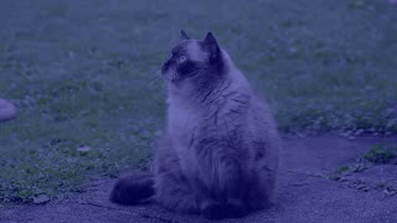

# NeuroVision



[](https://badge.fury.io/py/neurovision)
[](https://opensource.org/licenses/MIT)
[](https://github.com/CodeForgeNet/neurovision/actions)

**Motion detection using the fly optic lobe architecture.**



A lightweight, CPU-friendly motion detection library based on real connectome data from the *Drosophila* (fruit fly) brain. Implements the Hassenstein-Reichardt correlator using synapse weights extracted from the Virtual Fly Brain (VFB) connectome.

## Why NeuroVision?

- **Biologically grounded**: Uses actual synapse counts from the T4/T5 direction-selective neurons (hemibrain connectome)
- **Lightweight**: ~100KB, zero GPU dependency, works on edge devices (Raspberry Pi, phones, drones)
- **CPU-friendly**: Fast processing with biological validity
- **Production-ready**: Typed, tested, documented Python library, entirely self-contained with no external API calls required at runtime.

### Who is this for?

- **Robotics & Drone Devs**: Need fast, low-power obstacle avoidance.
- **Edge AI Builders**: Running vision on Raspberry Pi or mobile with zero GPU.
- **Neuroscience Geeks**: Want to play with real brain connectome math.

## Installation

### From PyPI
```bash
pip install neurovision
```

### From source
```bash
git clone https://github.com/CodeForgeNet/neurovision
cd neurovision
pip install -e .
```

## How to Use It

NeuroVision ships with pre-extracted biological connectome weights built directly into the library, so you can start detecting motion immediately.

### Quick Example: Process a Video

The simplest way to use NeuroVision is to process a video file and output an annotated video with a motion heatmap and directional arrows.

```python
from neurovision import NeuroVisionDetector

detector = NeuroVisionDetector()

saliency, motion_vectors = detector.process_video(
    "input.mp4",
    output_video="output_with_motion.mp4",
    overlay_vectors=True
)
```

### Real-time / Frame-by-Frame Processing

If you are reading from a webcam or integrating into a larger robotics pipeline, you can process individual frame pairs in real time:

```python
import cv2
from neurovision import NeuroVisionDetector

detector = NeuroVisionDetector()
cap = cv2.VideoCapture(0)

ret, frame_prev = cap.read()

while True:
    ret, frame_curr = cap.read()
    if not ret: break
    
    # Detect motion between two frames
    saliency, vectors = detector.process_frame_pair(frame_prev, frame_curr)
    
    # Display the result
    cv2.imshow("Motion Saliency", (saliency * 255).astype('uint8'))
    if cv2.waitKey(1) == ord('q'): break
    
    frame_prev = frame_curr
```

## What it Provides

### Saliency Map
The library returns a `saliency` map, which is a 2D NumPy array representing the intensity of motion detected across the visual field (scaled from `0.0` to `1.0`).

### Motion Vectors
For more precise data, the library returns a dictionary of motion vectors broken down into local spatial tiles (e.g., 8x8 pixels). Each tile contains:
- `direction`: The dominant motion direction (`up`, `down`, `left`, `right`)
- `confidence`: The strength of the detection (`0.0 - 1.0`)
- `x`, `y`: The tile coordinates

## Architecture & Biological Background

The fly's motion detection system is one of the most well-understood neural circuits. This library translates that biology directly into code using real connectome data (synapse weights), rather than arbitrary constants:

- **T4/T5 Neurons**: The core of fly motion vision. T4 neurons detect moving bright edges (ON pathway), and T5 neurons detect moving dark edges (OFF pathway). Each is divided into 4 subtypes corresponding to the 4 cardinal directions (up, down, left, right).
- **Medulla Interneurons**: Signals from photoreceptors are split into L1 (light-sensitive) and L2 (dark-sensitive) channels. They pass through medulla interneurons (Mi1, Tm3, etc.) which act as temporal delay lines.
- **Hassenstein-Reichardt Correlator**: By multiplying a delayed signal from one photoreceptor with an undelayed signal from a neighboring one, the brain determines direction and speed.
- **Connectome Weights**: We queried the *Drosophila* hemibrain connectome via neuprint to extract precise synapse counts between these neurons, normalizing them to build our correlator weights.

## Performance

Benchmark on Intel i7-12700K, 1280×720 video:

| Metric | NeuroVision | OpenCV OpticalFlow | TensorFlow RAFT |
|--------|-----------|-------------------|-----------------|
| FPS | 45-50 | 30-35 | 5-10 (GPU) |
| Latency (ms) | 20-25 | 28-35 | 100+ |
| Memory (MB) | 15 | 25 | 500+ |
| Model size | <1MB | N/A | 200MB |

## FAQ

**Q: Why is this better than optical flow?**  
A: It's not always better—it's complementary. NeuroVision trades absolute precision for massive simplicity (no GPU, tiny model). It is excellent for edge devices, real-time reactive systems, and biological validity.

**Q: Can I use this on mobile/Raspberry Pi?**  
A: Yes. It's pure Python + NumPy/OpenCV (both available on ARM).

**Q: What if I want higher accuracy?**  
A: Decrease `tile_size` (e.g., to 4 or 8) during initialization for finer spatial resolution, or use the raw motion vectors instead of the saliency map for pixel-level detail.

## License

MIT License. See `LICENSE` for details.

## Citation

If you use NeuroVision in research, please cite:

```bibtex
@software{neurovision,
  title={NeuroVision: Motion Detection Using Fly Optic Lobe Architecture},
  author={CodeForgeNet},
  year={2026},
  url={https://github.com/CodeForgeNet/neurovision}
}
```
